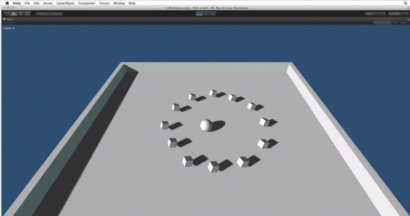

## Roll a Ball

Game to roll a ball around a board and pick up objects until there are no objects left.

[Tutorial followed from here](https://www.youtube.com/watch?v=lv0SqtSzBxc)

An introduction to the Roll-a-ball assignment, showing the final game and describing what will be covered in this assignment. This was created for an after school computing club, I wrote a set of text tutorials for people to follow based on the unity video tutorials.

1. [Tutorial 1](tutorials/Section1.md)
2. [Tutorial 2](tutorials/Section2.md)
3. [Tutorial 3](tutorials/Section3.md)
4. [Tutorial 4](tutorials/Section4.md)
4. [Tutorial 5](tutorials/Section5.md)
4. [Tutorial 6](tutorials/Section6.md)
