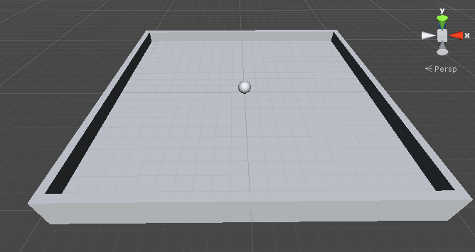
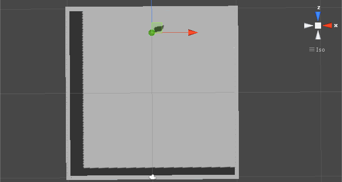
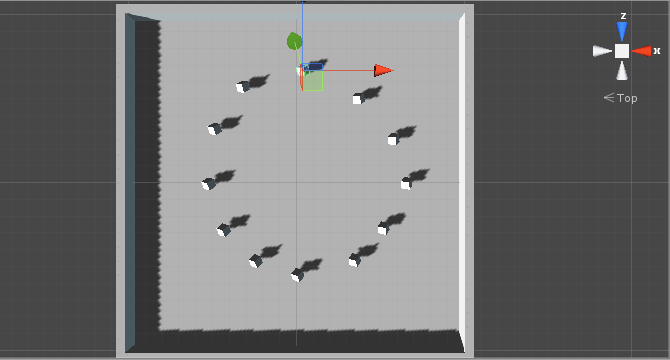

### Play area & pick-up objects
In this tutorial we will first setup our play field. This will be very simple and consist of 4 walls to stop the ball from rolling off. We will then create our pickup objects for the player to interact with.
[Tutorial followed from here](https://www.youtube.com/watch?v=4l2YJsgmusI)

1. First we should create a group object for the walls (like we did for the lighting). This will contain all of our walls.
  1. Click `GameObject` > `Create Empty`
  2. Rename the 'GameObject' to 'Walls'. You can imagine this as a folder to keep all of our wall objects in.
  3. Reset the `Walls` object to origin (transform section > settings cog > reset)
2. Now we will create our walls.
  1. Click `GameObject` > `3D object` > `Cube` to create a cube.
  2. Drag it into the `Walls` object we just created.
  3. Rename it `West Wall`
  4. Reset its position.
  5. Double click on the `West Wall` object to zoom into it.
  6. Now we need to expand its size to match our ground space.
    1. Under the `transform` page set the scale-X to 0.5 (to make it thin)
    2. Set the scale-Y to 2 (to make it tall)
    3. Set the scale-z to 20.5 (to make it long) or set it as long as your ground object.
  7. Now we need to move the wall into place.
    1. You can do this by using the translate tool & clicking on the red/blue arrows to move it.
    2. Or you can set its X/Z positions in the transform panel. (-10 if you followed my tutorial exactly)
  8. Now we need to do the same for the opposite wall. We could create a new cube but to make things easier we can duplicate this wall and move it where we want to.
    1. Right click on `West Wall` and duplicate.
    2. Rename this to `East Wall`
    3. Move it into place on the opposite side of the board (or set the position-X to 10).
  9. Duplicate `West wall` once again.
    1. Rename it to `North Wall`
    2. Set the position-X to 0 to center it again.
    3. Now we need to rotate it so set the rotation-Y to 90.
    4. Move it to the north side of board (or set the position-Z to 10)
  10. Duplicate the `North Wall` one last time.
    1. Rename it to `South Wall`
    2. Move it to the opposite side of the board (or set positon-Z to -10).
  11. Enter Play mode and test. Your board should now look like this.
      
3. Now lets create our collectible objects.
  1. Create a new cube and rename it 'Pickup'
  2. Reset the pickup's transform to origin.
  3. Focus the camera on the `PickUp` object by double clicking it.
  4. You can see that the player object (the ball) is in the way.
    1. Lets temporarily remove the object from view so that we can work cleanly.
    2. Click the `Player` object.
    3. At the top of the inspector panel there is a check-box next to the name 'Player'
    4. Toggle this to off so that we cannot see the `Player` object.
  5. Click the `PickUp` object once again.
  6. We can see that is is buried in the ground like our player object (the ball) was when we first created that.
    1. We can lift it up by half a unit so we know its resting on the ground.
    2. Set the positon-Y to 0.5
  7. This cube needs to attract the attention of the player, so lets make it more attractive! First lets make it smaller.
    1. Change the scale-x, scale-Y and scale-Z of the `PickUp` object to 0.5.
    2. This also gives it the effect of 'floating' above the board.
  8. Now lets tilt it over.
    1. Change the rotation-X, rotation-Y and rotation-Z of the `PickUp` object to 45.
    2. We can see that its now standing on its point.
  9. Theres something else we can do to attract the players attention, spin the cube. To do this we need to create a new script.
    1. With the `PickUp` object selected, click the 'Add Component' button in the inspector panel.
    2. Create a `New Script` called `Rotator` and select the language as `CSharp`.
    3. Remember this created the file in the `Assets` folder so drag it into the `Scripts` folder.
    4. Now open the script for editing.
    5. We wont be using the `Start()` function this time so go ahead and remove it.
    6. We are not using any physics calculations so we can use the `Update()` function. **All of our code will go inside this function.**
    7. What we are doing is changing the values of rotation-X, rotation-Y and rotation-Z of the `PickUp` object every frame.
    8. First we need to create a new Vector3 variable called `vector`. This is our rotational movement we want to apply to the `PickUp` object.

        ```
        Vector3 vector = new Vector3(15, 30, 45);
        ```

    9. Now we want to apply this movement in a rotation. We do this through the [transform.Rotate](http://docs.unity3d.com/ScriptReference/Transform.Rotate.html) method and pass it our `vector` variable as a parameter.

        ```
        transform.Rotate (vector * Time.deltaTime);
        ```

    10. Check your script against mine [**here**](https://github.com/Mattie432/Roll-a-ball/blob/v0.4/code/Assets/Scripts/Rotator.cs). Save this script and return to unity.
    11. Press play and check that everything is working fine.
4. The next thing we need to do is set our game board up with multiple of the `PickUp` objects.
  1. Instead of creating lots of cubes in the same way we did step 3 we are going to create a 'Prefab' (imagine this as a template) which we can use to easily create copies of our `PickUp` object.
  2. First we need to create a new folder in the `Assets` folder called `Prefabs`
  3. Now drag our `PickUp` object into this folder.
  4. When we drag an item from our hierarchy into our projects view (like we just did) we create a 'prefab' of that object.
  5. Before we drag our `PickUp` items around the game are we should create a new `GameObject` to hold them (like we did for the walls).
  6. Click `GameObject` > `Create Empty` and rename it to `PickUps`
  7. Reset the `Pickups` object to origin.
  8. Drag the `PickUp` object into it.
5. Now we want to spread these pickup objects around the play area.
  1. First make sure we have the `PickUp` object selected.
  2. Now lets change to a 'Top down' view by clicking the Y icon in the top right of the `scene view`.
  3. Zoom out a little so we can see the whole game board.
  4. In the top left of the window, make sure that `Global` is selected as the mode. (if its local then change it)
  5. Drag the `PickUp` object to the top of the game board.
      
  6. Now we need to duplicate the `PickUp` object and spread them around the board. With the `PickUp` object selected press `Ctrl + D` to duplicate the item.
  7. Move the duplicate around the board and keep doing this to create a circle shape out of these `PickUp` objects.
      
  8. Okay looking good! Lets press play and test!


You can download the project at this stage [here](https://github.com/Mattie432/Roll-a-ball/releases/tag/v0.4)

###[Next Tutorial > 5](Section5.md)
