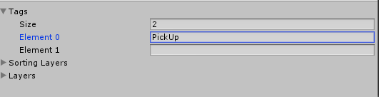

### Collecting & Counting
We want to be able to pickup our collectible game objects when our ball collides with them. To do this we need to detect our collisions between the two.
[Tutorial followed from here](https://www.youtube.com/watch?v=Zyf0mESsz9k)

1. First we don't need our player to be inactive, so lets check the 'active' check-box and bring back our player (the ball).
2. Have a look at the inspector while the `Player` object is selected.
  1. You can see a panel called `Sphere Collider`
  2. This is the volume that Unity uses to calculate whether an object is touching/colliding with another object.
  3. In unity, an objects collision volume and its drawn volume can be different. This means that we can change its collision radius to be either bigger or smaller than the object.
3. Next lets open the `PlayerController` script for editing.
4. Now that we have the script open what code are we going to write?
  1. If we look in the documentation we can see that there is a method called [OnTriggerEnter](http://docs.unity3d.com/ScriptReference/Collider.OnTriggerEnter.html) which can be used to detect the contact between the player and other objects.
  2. This method is what we need to use to lets add it to our script file (underneath the `FixedUpdate()` method.)

      ```c
    	void OnTriggerEnter(Collider other) {
        //Our code will go here
    	}
      ```

  3. Lets think what we want to do when we detect a collision? Firstly we need to look and see if the object we are colliding with is a `PickUp` object. If we didnt check this then our code would run when our ball touched a wall or the floor.
    1. To do this we can use 'tags'. A tag allows us to identify the game object in our code.
    2. In order to see the 'tag' in our code we need to return to Unity and set the tag for the `PickUp` objects.
    3. Open the `Prefabs` folder we created in the last tutorial and click on the `PickUp` object inside.
    4. In the inspector we can see (near the top) there is a 'tag' field which currently says "untagged".
    5. Click the drop down menu and select `New Tag`
    6. Expand the `Tags` section and next to `Element 0` type 'PickUp'
        
    7. Click on the `PickUp` object inside the `Prefabs` folder again and now the drop down tag menu will contain the tag `PickUp`
    8. Select this and then click the other `PickUp` objects inside of the `Hierarchy` view. You can see that they have also been changed to `PickUp`. This is the power of `Prefabs`, any changes to the 'template' will also be changed on anything using this template and saves us a lot of time.
    9. Now lets return to our code, we need to check if the object we are touching is a `PickUp` object. We can do this by using an if statement.
    10. Add this code inside of the `OnTriggerEnter()` method. Be careful as the name 'PickUp' is case sensitive!

        ```c
        if (other.gameObject == "PickUp") {
          \\Here we know that other is a 'PickUp' object.
        }
        ```

    11. What this is doing is looking at the tag of the object we are touching (other) and checking to see if it is the same as "PickUp" which is what we have tagged all of our `PickUp` objects as.
  4. We now know when we hit a `PickUp` object. Lets do something when this collision happens.
    1. For now, lets just disable the `PickUp` object (like we did with the ball at the end of last tutorial) so that it cannot be seen.
    2. We can set the 'Active' state of an object in the script. Add this line inside of our If statement, it will set the 'Active' state of the object we are colliding with to 'false' so it will not be seen.

        ```c
        other.gameObject.SetActive(false);
        ```

  5. Thats it for our script! Check yours against mine [**HERE**]() Save and return to unity.
5. Return to Unity and press play. See what happens.
  1. You can notice that nothing seems to have changed. When we knock into a `PickUp` object it does not dissapear as we want.
  2. This is because our object is a 'collider' object and we are using the `onTriggerEntered()` method. (dont worry too much about this as its quite complicated)
  3. We need to change our `PickUp` objects to 'triggers' so that they work as expected.
  4. Click on our `PickUp` object in the `Prefabs` folder.
  5. Under the panel for `Box Colider` you can see a check-box for `Is Trigger`
  6. Check this on and press play again.
6. Looking good but we are not quite done yet! In unity there are two types of objects, _static_ and _dynamic_. Static objects (such as walls & the floor) and dynamic objects (like our ball). Unity calculates its physics interactions differently for these types of objects as static objects aren't usually moved they are all calculated together. They are **all** re-calculated when any one of those objects are changed (like when we rotate the `PickUp` objects). This is very inefficient (especially in larger games) so...

  **TLDR:** we need to change our `PickUp` cubes to 'Dynamic' objects.
  1. We do this by adding a `RigidBody` to our `PickUp` cubes. This instantly makes them dynamic.
  2. Click on the `PickUp` object inside the `Prefabs` folder again.
  3. Now click 'Add Component' and select Physics > RigidBody
  4. Once again as we are doing this to the Prefab it applies our change to anything that uses this template.
  5. Press play and see what happens!
  6. This is because gravity pulls them down! And because they are `Triggers` they do not collide with the floor.
  7. Have a look at the `Rigidbody` panel in the inspector.
    1. We could just disable gravity. This would stop them being pulled down, but they would still be affected by other forces (like a cube hitting them and knocking them over).
    2. Instead we will toggle `Is Kinematic` which will not react to forces!
  8. Good, lets press play again and see can see that is it all working again! And its performant !
