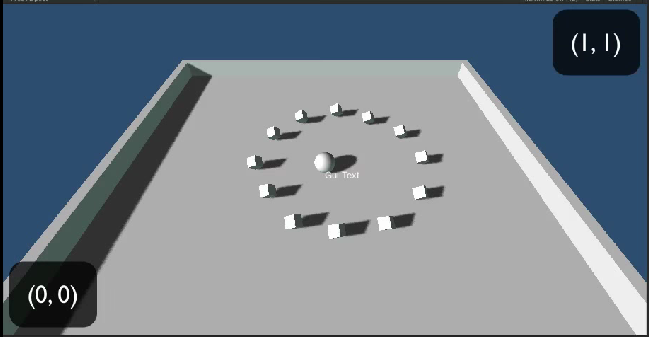
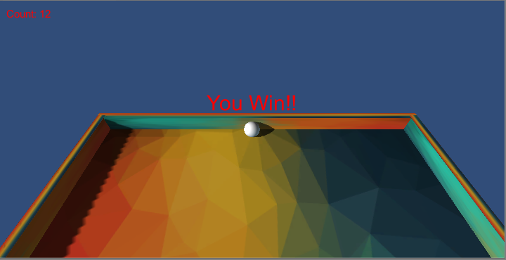

### Displaying text & Ending the game
We want to be able to display the number of objects the player has picked up and also display a message when there are no more objects left.

[Tutorial followed from here](https://www.youtube.com/watch?v=7s5bEWZycHQ)

1. First we need to add a 'count' of how many pickup objects the player has collected.
  1. Open the `Player Controller` (or `Player Movement`) script for editing.
  2. First we need to add a Private variable to hold our count. Add this line under our `speed` variable.

      ```c
      Private int count;
      ```

  3. In our game we will first start with a count of 0 and then increment this as we pickup a new object. We now need to set the value of count and to do this we use the `void Start ()` method.

    Inside of `Start()` method set the value of `count` to 0.
  4. Next we will need to increment this count when the player picks up an object. We already have an `IF` statement to detect the collisions so we can use this to add one to the count IF its a pickup object.

    Increase the count variable by 1 inside of the `IF` statement that checks if its a PickUp object.
2. We now have a count variable that is storing the number of objects collected, but no way to display this to the user.
  1. First create a new `Empty Game Object` to act like a folder for the text items (Game Object > Create Empty).
  2. Rename this to `DisplayText` and reset the transform to origin.
  3. Now we need to add a `GUIText` item. Select the `DisplayText` object and either:

    _< version 4.6_  
    __GameObject > GUIText__

    or

    _>= version 4.6_  
    __Create an empty game object.  
    Select it, then click  
    Component > Rendering > GUIText__

    depending on your version of Unity.

  4. Drag and drop this onto the `DisplayText` parent and rename it to `CountText`
  5. Set the `X` & `Y` position of `CountText` to 0.5  
     You can see that the text is positioned in the center of the screen. This is because the GUI text only shows up in the players view (so not in the actual game) and the coordinates of this view go from (0,0) in the bottom left, to (1,1) in the top right.

     
   6. We want the count to show up out of the way of the player, set the position of `CountText` to X=0, Y=1.
   7. It looks budged up in the corner, lets give it some space between the edges of the screen. Change the `Pixel Offset` values to give it some space from the screen edge.

3. Now we want to change the value of the text when the user picks up an object. Open the `Player Controller` (or `Player Movement`) script for editing.
  1. Next create a new Public variable of type GUIText called countText. (remember public variables allow us to drag & drop the components they are associated with in unity).
  2. We want to set the starting value of the text. We do this in the `Start()` method.

    ```c
    countText.text = "Count: " + count.ToString();
    ```

  3. We also want to update the text after we have picked up an object. Also add the line below where we increment the count in the `IF` statement of the `OnTriggerEnter` method.

  4. We now have two line of code that are exactly the same. This is generally bad, what we can do is create a functin to do this in one place and call it.

      Create a function `void SetCountText()` and replace the lines of code with calls to this function.
  5. Save and open Unity again.

4. We can now see that there is a new field under the `PlayerMovement` script when we click on the `Player` object. We need to ascociate this with the text object. Drag `CountText` onto this field & press play.

5. Now I want you to display a message when the player has collected _all_ of the cubes. use the same method that we just did and ask for help if you get stuck!!

  

Check your code against mine [**HERE**](https://github.com/Mattie432/Roll-a-ball/blob/v0.6/code/Assets/Scripts/PlayerMovement.cs)
You can download the project at this stage [here](https://github.com/Mattie432/Roll-a-ball/releases/tag/v0.6)
